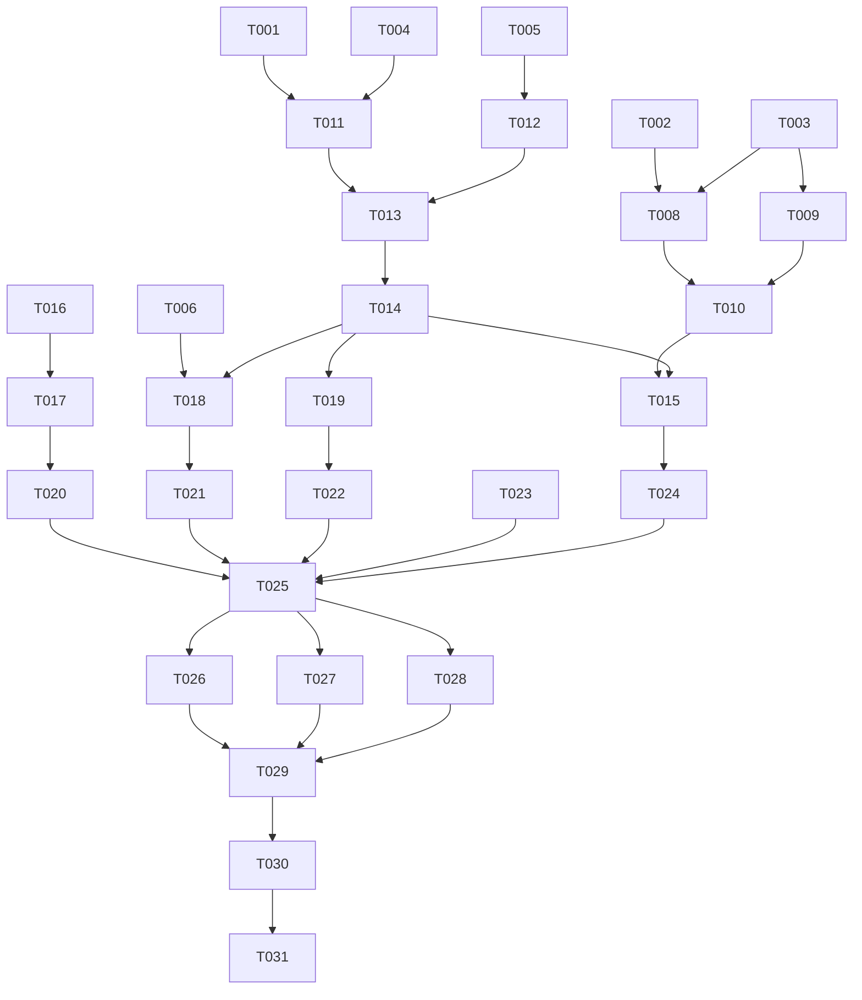

# Migración de infraestructura de finanzas-hacku — Desglose de Tareas

**Plan:** 001-migracion-vercel-jeremy-a-producto/plan.md
**Created:** 2026-08-25

---

## Format

`[ID] [Flags] [Story] Descripción`

- **[P]**: puede correr en paralelo (sin dependencias con otra tarea en curso)
- **[Story]**: US1..US5 o INFRA
- ⚠️ = punto de no-retorno / requiere doble verificación antes de ejecutar

---

## Phase 0: Inventario, accesos y preparación (BLOQUEA TODO)

- T001 [INFRA] Confirmar acceso admin a `producto@hacku.co` en **Vercel**; si no existe cuenta/equipo corporativo, crearlo. Definir plan (Hobby vs Pro) según límites de crons/dominios/protección.
- T002 [P] [INFRA] Confirmar la **organización de GitHub** corporativa destino (nombre exacto) y que `producto@hacku.co` es admin. Resolver `[NEEDS CLARIFICATION: nombre de la org]`.
- T003 [P] [INFRA] Solicitar a Jeremy acceso admin a GitHub `johacku` (o al repo). Registrar resultado: **decide ruta A vs B** del repo.
- T004 [INFRA] Intentar acceso al **login de Vercel de Jeremy** (`jeremy@hacku.co`). Registrar resultado: **decide ruta A vs B** de Vercel. Si no hay 2FA, iniciar recuperación vía control del correo o abrir ticket a soporte de Vercel.
- T005 ⚠️ [INFRA] **Exportar el inventario completo de variables de entorno** del proyecto actual (`vercel env pull .env.production.local` con `vercel link` al proyecto, o copiarlas del dashboard). Guardarlo en un vault seguro. NO commitear. Este archivo es el seguro de toda la migración.
- T006 [P] [INFRA] Inventariar dominios/aliases del proyecto (`finanzas-hacku.vercel.app` + `-git-main-` + `-hacku-finanzas`), los **crons** de `vercel.json`, y la **URL actual del webhook en Alegra**.
- T007 [P] [INFRA] Verificar **quién es dueño real de Alegra, Supabase y Google (Sheets/Apps Script)**. Si alguno está a nombre de Jeremy, marcarlo y abrir spec/riesgo aparte. Resolver `[NEEDS CLARIFICATION]` de dueños.

## Phase 1: Rescate del código (GitHub) — US3

- T008 ⚠️ [US3] **Ruta A** (si T003 dio acceso): GitHub → repo `johacku/finanzas-hacku` → Settings → Transfer ownership → org corporativa. Confirmar redirección activa.
- T009 [US3] **Ruta B** (fallback si sin acceso): `git clone --mirror https://github.com/johacku/finanzas-hacku` → crear repo vacío en la org → `git push --mirror`. Verificar ramas (`main`, otras) y tags.
- T010 [US3] Verificar que la org tiene el repo con **toda la historia y ramas** y decidir visibilidad (evaluar hacerlo privado).

## Phase 2: Propiedad de Vercel — US1

- T011 ⚠️ [US1] **Ruta A** (si T004 dio acceso): desde el equipo de Jeremy iniciar transfer-request del proyecto (`POST /projects/finanzas-hacku/transfer-request`) → aceptar desde el equipo de `producto@hacku.co` (`PUT /projects/transfer-request/{code}`). Verificar que preservó dominio y stores.
- T012 [US1] **Ruta B** (fallback): crear proyecto nuevo en el equipo corporativo conectado al repo de la org (`create_git_project` / dashboard). Recrear TODAS las variables de entorno desde el inventario T005 (`vercel env add` por entorno).
- T013 [US1] Verificar en el proyecto migrado: variables de entorno completas y por entorno correcto (prod/preview/dev), Node 24.x, settings de build.
- T014 [US1] Forzar/confirmar un deployment de **producción** READY en el nuevo proyecto y que el dominio de producción sirve la app.

## Phase 3: Reconexión de pipeline e integraciones

### US3 — pipeline Git
- T015 [US3] Reconectar la integración Git de Vercel al repo de la **org** (no `johacku`). Confirmar que la GitHub App de Vercel tiene acceso al repo.

### US2 — Slack
- T016 ⚠️ [US2] Reinstalar la Slack App "hackU Finance Notifications" con **identidad de servicio corporativa** (ADR-3). Generar nuevo **Bot User OAuth Token** (`xoxb-...`).
- T017 [US2] Actualizar `SLACK_BOT_TOKEN` en Vercel (producción) con el token nuevo (`vercel env rm` + `vercel env add`, o dashboard) y **redeploy** de producción.

### US4 — Alegra + crons
- T018 ⚠️ [US4] Si el dominio cambió respecto al inventario T006, **actualizar la URL del webhook en Alegra** a la nueva. Si no cambió, confirmar que sigue válida.
- T019 [US4] Confirmar que los **crons** de `vercel.json` quedaron agendados en el proyecto migrado y protegidos por `CRON_SECRET`.

## Phase 4: Verificación end-to-end (GATE antes de Phase 5)

- T020 [US2] Smoke test Slack: crear una **solicitud de factura de prueba** → verificar que publica en el canal (SC-002).
- T021 [P] [US4] Smoke test Alegra: verificar `/api/alegra-webhook` responde **200** desde el dominio nuevo (SC-004); confirmar recepción sin gap.
- T022 [P] [US4] Verificar ejecución de **cron** (invocación protegida) y que las comisiones recurrentes se generan idempotentemente (SC-005).
- T023 [P] [INFRA] Smoke test integraciones restantes: query a Supabase OK; export a Google Sheets OK (o registrar el fallo `[Sheets]` como preexistente/fuera de alcance).
- T024 [US3] Push de prueba a `main` en el repo de la org → confirmar **deploy de producción exitoso** (SC-003).
- T025 [INFRA] ✅ **GATE:** solo si T020–T024 pasan, autorizar Phase 5. Si algo falla, mantener el proyecto de Jeremy vivo (rollback = no continuar).

## Phase 5: Revocación de Jeremy y hardening — US5

- T026 ⚠️ [US5] Eliminar a Jeremy de **Vercel** (miembro/owner del proyecto/equipo).
- T027 ⚠️ [P] [US5] Eliminar a `johacku` como colaborador/owner en el repo de la **org** de GitHub.
- T028 [P] [US5] Confirmar que Jeremy no tiene acceso en **Slack** a la app ni al workspace admin; revocar cualquier token suyo.
- T029 [US5] Auditoría final: Vercel + GitHub + Slack + Alegra + Supabase + Google **no listan a Jeremy** como owner/miembro (SC-001).
- T030 [US5] Rotar secretos sensibles conocidos por Jeremy (matriz FR-012): `CRON_SECRET`, credenciales Alegra/Supabase/Google **uno por uno**, reconfigurando cada consumidor externo y verificando tras cada rotación.
- T031 [INFRA] Documentar el **nuevo mapa de propiedad** (quién controla Vercel/GitHub/Slack/Alegra/Supabase/Google) y accesos de respaldo (FR-013).

---

## Dependency Graph

## Execution Order

1. **Phase 0** — T001, T002, T003, T004, T005 (crítica), T006, T007 (varias en paralelo)
2. **Phase 1** — T008 **o** T009 (según ruta) → T010
3. **Phase 2** — T011 **o** T012 (según ruta) → T013 → T014
4. **Phase 3** — T015; T016→T017; T018; T019
5. **Phase 4 (GATE)** — T020, T021, T022, T023, T024 → T025
6. **Phase 5** — T026, T027, T028 → T029 → T030 → T031

> **Regla de oro:** no ejecutar Phase 5 (borrar a Jeremy / rotar secretos) hasta que el GATE T025 esté verde. Hasta entonces, el sistema de Jeremy sigue siendo el rollback.
